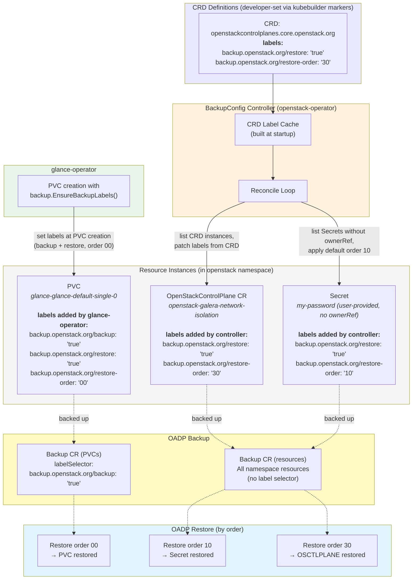

# Backup and Restore Design

## Overview

This document describes the design for backup and restore of OpenStack on OpenShift. The approach eliminates hardcoded resource lists by using CRD labels to declare backup/restore behavior, and a controller (OpenStackBackupConfig) to automatically label resource instances.

> **Note:** An earlier version of this design proposed using mutating admission webhooks to label resources at creation time. After evaluation, the controller-based approach was chosen instead. See [Controller vs Webhook Approach](#controller-vs-webhook-approach) for the rationale.

## Goals

1. **Full Backup, Selective Restore** (for CRs, Secrets, ConfigMaps):
   - Backup: All user resources (Secrets, ConfigMaps, CRs) - complete snapshot
   - Restore: Only labeled resources - automatic filtering via label selectors
   - **Exception - PVCs**: Selective backup AND selective restore (only labeled PVCs backed up/restored due to storage/performance concerns)
2. **Dynamic Resource Discovery**: No hardcoded lists - CRD labels declare what needs restore
3. **Declarative Restore Order**: Restore order defined in CRD labels, not in code
4. **Operator-Managed Exclusion**: Operators recreate their own resources (not restored from backup)
5. **Kubernetes-Native**: Leverage label selectors for filtering
6. **Controller-Based Labeling**: OpenStackBackupConfig controller labels CR instances based on CRD labels

## Key Concepts

### CRD Labels

CRD definitions use **restore labels** to control which instances should be restored (all prefixed with `backup.openstack.org/`):

```yaml
apiVersion: apiextensions.k8s.io/v1
kind: CustomResourceDefinition
metadata:
  name: openstackcontrolplanes.core.openstack.org
  labels:
    # Restore labels (explicit opt-in - must be present to restore)
    backup.openstack.org/restore: "true"
    backup.openstack.org/category: "controlplane"
    backup.openstack.org/restore-order: "30"
```

**Labels:**

- `backup.openstack.org/restore`: Whether instances of this CRD should be restored
  - **Default if missing**: `"false"` (explicit opt-in required - only restore what's needed)
  - `"true"`: Include in restore (controller adds restore labels to instances)
  - `"false"`: Exclude from restore (controller does NOT add restore labels)

- `backup.openstack.org/category`: Category for selective backup/restore
  - `"controlplane"`: Control plane resources (OpenStackControlPlane, MariaDB, services, user-provided Secrets/ConfigMaps, PVCs)
  - `"dataplane"`: Data plane resources (NetConfig, Topology, IPSet, Reservation, DataPlaneNodeSet)

- `backup.openstack.org/restore-order`: Numeric order for restore sequence
  - Uses gaps of 10 (e.g., `"00"`, `"10"`, `"20"`, `"30"`) to allow easy insertion of new resources
  - Common orders:
    - 00 (storage foundation - PVCs)
    - 10 (foundation - NADs, Secrets, ConfigMaps)
    - 20 (TLS & infrastructure - custom Issuers, MariaDB, NetConfig, OpenStackVersion)
    - 30 (CtlPlane + networking)
    - 40 (backup config & user resources)
    - 50 (manual steps - database/RabbitMQ restore, resume deployment)
    - 60 (DataPlane)

**Restore Strategy:**

- ✅ **Full backup**: All CRs backed up by OADP (no label selector on Backup CR)
- ✅ **Selective restore**: Only CRs with `backup.openstack.org/restore: "true"` label on CRD are restored
- ✅ **Clear intent**: CRD labels declare what needs restoration
- ✅ **Dynamic discovery**: Query CRDs with `oc get crd -l backup.openstack.org/restore=true`
- ✅ **Controller-friendly**: Controllers can watch/list CRDs by label selector

**Examples:**

```yaml
# OpenStackDataPlaneDeployment - backup but DON'T restore
apiVersion: apiextensions.k8s.io/v1
kind: CustomResourceDefinition
metadata:
  name: openstackdataplanedeployments.dataplane.openstack.org
  labels:
    # NO backup-restore label        # Don't restore (default: false)
    # All instances still backed up (full namespace backup)

# OpenStackControlPlane - backup AND restore
apiVersion: apiextensions.k8s.io/v1
kind: CustomResourceDefinition
metadata:
  name: openstackcontrolplanes.core.openstack.org
  labels:
    backup.openstack.org/restore: "true"              # Include in restore
    backup.openstack.org/category: "controlplane"
    backup.openstack.org/restore-order: "30"
```

### Controller-Based Labeling (OpenStackBackupConfig)

The OpenStackBackupConfig controller handles resource labeling centrally from the openstack-operator. It discovers CRDs with backup-restore labels and patches matching labels onto CR instances.

**How it works:**

1. **CRD Label Cache**: Built once at operator startup, maps CRD names to their backup labels
2. **CR Instance Labeling**: Controller lists CR instances for each labeled CRD and patches backup labels onto them
3. **User Resource Labeling**: Secrets, ConfigMaps, and NADs without ownerReferences are labeled for restore (with cert-manager secret filtering — see below)
4. **PVC Labeling**: Service operators (glance-operator, mariadb-operator) label their PVCs directly

**Key Points:**

1. **Centralized**: Single controller in openstack-operator handles all API groups
2. **Retroactive**: Labels resources that existed before the controller was deployed
3. **Safe**: Controller failure doesn't block resource creation
4. **Dynamic Discovery**: Uses CRD label cache — adding labels to a new CRD type automatically includes its instances
5. **User-Provided Detection**: Only labels Secrets/ConfigMaps/NADs without ownerReferences (user-provided)

#### Labeling Flow Example

The following diagram shows how backup/restore labels flow from CRD definitions
and operator logic to resource instances, using OpenStackControlPlane, a
user-provided Secret, and a Glance PVC as examples.



**How it works in this example:**

1. **OpenStackControlPlane CRD** has `restore: "true"` and `restore-order: "30"` labels set by the developer via kubebuilder markers
2. **BackupConfig controller** builds a CRD label cache at startup, then reconciles:
   - Lists all OpenStackControlPlane instances → patches restore labels from the CRD onto each instance
   - Lists all Secrets without ownerReferences → patches default restore labels (order 10)
3. **glance-operator** creates PVCs with backup labels directly using `backup.EnsureBackupLabels()` (order 00)
4. **OADP Backup** creates two Backup CRs: one for all resources (no selector), one for labeled PVCs only
5. **OADP Restore** creates Restore CRs per order: PVCs first (00), then Secrets (10), then ControlPlane (30)

### Controller vs Webhook Approach

An earlier version of this design proposed using mutating admission webhooks to label resources at creation time. The controller-based approach was chosen instead for these reasons:

| Aspect | Controller (chosen) | Webhook (considered) |
|--------|--------------------|--------------------|
| **Complexity** | Single controller, centralized | Webhook per operator, distributed |
| **Infrastructure** | No extra TLS/service/webhook config | Requires webhook TLS certs, services, configs per operator |
| **Retroactive labeling** | Yes — labels existing resources | No — only fires on create/update; needs controller fallback anyway |
| **Failure impact** | Labels delayed, resource creation not blocked | Webhook failure blocks all resource creation |
| **Testing** | Simple envtests | Requires webhook server in tests |
| **Race condition** | Brief window before labeling | Atomic at creation time |

The theoretical race condition (resource created but not yet labeled when a backup runs) is not a practical concern: OpenStack deployments take minutes to hours to complete, and backups are scheduled operations. The controller labels resources within seconds of creation — long before any backup would run.

### Two Labeling Mechanisms

Resources get labeled for restore through two complementary mechanisms:

#### 1. Controller Labels CR Instances and User-Provided Resources

The OpenStackBackupConfig controller labels:
- **CR instances**: Based on CRD labels (e.g., OpenStackControlPlane, NetConfig, GaleraBackup)
- **User-provided Secrets**: Without ownerReferences (SSH keys, passwords, etc.)
- **CA cert secrets**: cert-manager secrets for CA Certificates (`spec.isCA: true`) — must be restored to preserve CA identity
- **User-provided ConfigMaps**: Without ownerReferences (custom configurations)
- **NetworkAttachmentDefinitions**: Without ownerReferences

**Not labeled for restore** (excluded by the controller):
- **Operator-managed leaf cert secrets**: cert-manager secrets where the Certificate CR has an ownerReference and `spec.isCA` is not true. These are regenerated by cert-manager from the restored CA Issuer and Certificate CRs.

#### 2. Operators Directly Label Resources They Create

Operators add restore labels when creating resources, even if those resources have ownerReferences:
- PVCs (glance-operator, mariadb-operator)
- Database password secrets (mariadb-operator)

**Why:** Some resources need restore even though they have ownerReferences:
- **PVCs**: Need snapshot restore before pods start (staged deployment)

**Issuers (cert-manager) — handled by ControlPlane controller:**

Operator-created Issuers (rootca-internal, rootca-public, rootca-ovn, rootca-libvirt, selfsigned-issuer) have ownerReferences pointing to the OpenStackControlPlane CR. They do **not** need backup labels because they are recreated automatically when the OpenStackControlPlane reconciles.

Custom Issuers (ACME, Vault, external CAs) referenced in `spec.tls.*.ca.customIssuer` do **not** have ownerReferences (they are user-provided). The ControlPlane controller labels these directly in `ca.go` when it processes the custom issuer — the same code path that adds CA selector labels.

**What gets labeled by the ControlPlane controller:**
- ✅ Custom Issuers referenced in `spec.tls.*.ca.customIssuer`
- ❌ Operator-managed Issuers (recreated by reconciliation)

**cert-manager Secrets — selective restore labeling:**

cert-manager creates TLS secrets for Certificate CRs, but these secrets do **not** get ownerReferences from the Certificate CR. The BackupConfig controller handles them specially:

- ✅ **CA cert secrets** (Certificate CR has `spec.isCA: true`) — labeled for restore to preserve the CA identity, even if the Certificate CR is operator-created
- ✅ **User-created cert secrets** (Certificate CR has no ownerRef) — labeled for restore
- ❌ **Operator-created leaf cert secrets** (Certificate CR has ownerRef, `spec.isCA != true`) — explicitly labeled `restore: "false"`; cert-manager regenerates them from the restored CA Issuer. Users can override this with an annotation (see [Annotation-Based User Overrides](#annotation-based-user-overrides)).

The controller checks the `cert-manager.io/certificate-name` annotation on each secret to look up the corresponding Certificate CR and determine if it should be labeled for restore.

**TODO: Move cert-manager secret labeling to service controllers.** The
BackupConfig controller's cert-manager lookup logic (checking Certificate CR
`isCA`, ownerRef filtering) could be replaced by labeling cert-manager secrets
directly in the controllers that already read them:

- **CA cert secrets**: The OpenStackControlPlane controller already reads CA
  cert secrets to build the CA bundle. It could add `restore: "true"` labels
  at that point.
- **Leaf cert secrets**: Service controllers (keystone, nova, etc.) read their
  TLS secrets during reconciliation. They could set `restore: "false"` labels
  there.

This would align with the pattern used for PVCs (glance-operator, swift-operator,
mariadb-operator) — operators label what they know about at the point where they
already interact with the resource. The BackupConfig controller's secret handling
would simplify to: "label Secrets without ownerRefs and without existing backup
labels" — no cert-manager awareness needed.

**Example: PVC creation with annotation override support**

```go
// In glance-operator when creating PVC
func (r *GlanceReconciler) createPVC(
    ctx context.Context,
    name string,
    instance *glancev1.GlanceAPI,
) error {
    pvc := &corev1.PersistentVolumeClaim{
        ObjectMeta: metav1.ObjectMeta{
            Name:      name,
            Namespace: instance.Namespace,
            Labels:    getBackupLabels(instance.Annotations), // Helper reads annotations
            OwnerReferences: []metav1.OwnerReference{
                {
                    APIVersion: instance.APIVersion,
                    Kind:       instance.Kind,
                    Name:       instance.Name,
                    UID:        instance.UID,
                    Controller: ptr.To(true),
                },
            },
        },
        Spec: corev1.PersistentVolumeClaimSpec{
            // ... PVC spec
        },
    }

    return r.Client.Create(ctx, pvc)
}

// Helper function to determine backup labels (with annotation override support)
func getBackupLabels(annotations map[string]string) map[string]string {
    labels := make(map[string]string)

    // Always add backup labels for PVCs
    labels["backup.openstack.org/backup"] = "true"
    labels["backup.openstack.org/restore"] = "true"

    // Check for user override via annotation
    if order, ok := annotations["backup.openstack.org/restore-order"]; ok {
        labels["backup.openstack.org/restore-order"] = order
    } else {
        labels["backup.openstack.org/restore-order"] = "00"  // Default for PVCs (storage foundation)
    }

    if category, ok := annotations["backup.openstack.org/category"]; ok {
        labels["backup.openstack.org/category"] = category
    } else {
        labels["backup.openstack.org/category"] = "controlplane"
    }

    return labels
}
```

**Summary:**
- **Controller**: Labels CR instances and user-provided resources (no ownerReferences)
- **Operators**: Label resources they create (can have ownerReferences)
- **Result**: All necessary resources get labeled for restore, regardless of ownership

### OADP Integration

OADP (OpenShift API for Data Protection) is Red Hat's distribution of Velero for
OpenShift. It requires an S3-compatible object storage backend for backup storage.
See [Certified backup storage providers](https://docs.redhat.com/en/documentation/openshift_container_platform/4.20/html/backup_and_restore/oadp-application-backup-and-restore#oadp-certified-backup-storage-providers_about-installing-oadp)
for supported backends (AWS S3, MCG, ODF, Ceph RGW, MinIO, etc.).

#### Split Backup: CRs and PVCs

The backup uses two OADP Backup CRs — one for all namespace resources (CRs, Secrets, ConfigMaps, etc.) and one for PVC snapshots:

```yaml
# Backup 1: All CRs and core resources (no PVCs)
apiVersion: velero.io/v1
kind: Backup
metadata:
  name: openstack-crs-20260303-120000
  namespace: openshift-adp
spec:
  includedNamespaces:
  - openstack
  excludedResources:
  - persistentvolumeclaims
  - persistentvolumes
  snapshotVolumes: false
  storageLocation: velero-1
  ttl: 720h
---
# Backup 2: Only labeled PVCs with CSI snapshots
apiVersion: velero.io/v1
kind: Backup
metadata:
  name: openstack-pvcs-20260303-120000
  namespace: openshift-adp
spec:
  includedNamespaces:
  - openstack
  includedResources:
  - persistentvolumeclaims
  labelSelector:
    matchLabels:
      backup.openstack.org/backup: "true"
  snapshotVolumes: true
  defaultVolumesToFsBackup: false
  storageLocation: velero-1
  ttl: 720h
```

**Why two Backup CRs?**
- PVCs require CSI snapshots (`snapshotVolumes: true`) which is expensive and should only target labeled PVCs
- CR/Secret/ConfigMap backup is a simple object store operation with no volume snapshots
- Separating them allows independent backup schedules (e.g., PVC snapshots less frequently)

**Backup 1 (CRs) captures:**
- ✅ **All Secrets** in namespace (user-provided AND operator-managed)
- ✅ **All ConfigMaps** in namespace (user-provided AND operator-managed)
- ✅ **All CRs** (OpenStackControlPlane, GaleraBackup, DataPlaneNodeSet, etc.)
- ✅ **All NetworkAttachmentDefinitions, custom Issuers, etc.**
- ❌ **Excluded**: PVCs/PVs (handled by Backup 2)

**Backup 2 (PVCs) captures:**
- ✅ **PVCs with label** `backup.openstack.org/backup: "true"` (CSI snapshots)
- ❌ **Unlabeled PVCs**: Not backed up

**Why backup ALL CRs/Secrets/ConfigMaps (no label selector on Backup 1)?**
- Ensures complete snapshot (nothing missed)
- Simple backup logic
- Restore is selective via labels (only resources with `backup-restore: "true"` labels are restored)
- Examples of backed up but not restored: DataPlaneDeployment, operator-managed Secrets/ConfigMaps

See [PVC Labeling Strategy](#pvc-labeling-strategy) for details on how PVCs are labeled for backup.

#### Selective Restore (By Order)

Multiple Restore CRs, one per restore order, using labels added by the controller.

**Restore Strategy:**
- ✅ **Only resources with** `backup.openstack.org/restore: "true"` **label**
- ✅ **Controller labels user-provided resources** (no ownerReferences) and CR instances
- ❌ **Operator-managed resources excluded** (no labels, will be recreated by operators)

This means:
- User-provided Secrets → Labeled by controller → Restored ✅
- CA cert Secrets (cert-manager, `isCA: true`) → Labeled by controller → Restored ✅ (preserves CA identity)
- Operator-created leaf cert Secrets (cert-manager) → Labeled `restore: "false"` → Not restored, regenerated by cert-manager ✅
- Operator-created Secrets (with ownerRef) → Not labeled → Not restored, recreated by operator ✅
- User-provided ConfigMaps → Labeled by controller → Restored ✅
- Operator-created ConfigMaps → Not labeled → Not restored, recreated by operator ✅
- CR instances (with CRD labels) → Labeled by controller → Restored ✅

#### OwnerReference and Annotation Handling

**The Problems:**

When OADP restores resources from backup, several metadata fields can cause issues:

**1. OwnerReferences with Stale UIDs:**

Each resource gets a NEW UID on restore (UIDs are cluster-unique identifiers). However, backed-up ownerReferences contain OLD UIDs from the original cluster. This causes:

- **Orphaned resources**: Restored resource has ownerReference with old UID that doesn't match the new owner's UID
- **Broken ownership chain**: Kubernetes doesn't recognize the ownership relationship
- **Potential data loss**: Operators might try to delete/recreate PVCs when they don't recognize them as owned resources

**Example:**
```yaml
# Backup: PVC owned by GlanceAPI
metadata:
  name: glance-pvc
  ownerReferences:
  - uid: old-glance-uid-123  # Old UID from backup

# After restore:
# - PVC has ownerReference: old-glance-uid-123
# - GlanceAPI NOT restored (operator-managed)
# - Operator creates NEW GlanceAPI with NEW UID: new-glance-uid-456
# - PVC is orphaned (UID mismatch)
# - Operator might delete/recreate PVC → DATA LOSS!
```

**2. last-applied-configuration Annotation Too Large:**

The `kubectl.kubernetes.io/last-applied-configuration` annotation stores the entire resource specification from the last `kubectl apply`. This can:

- **Exceed size limits**: Very large resources fail to restore due to annotation size
- **Cause API server errors**: etcd has size limits on annotations
- **Be unnecessary**: Resource will get new annotation on next apply

**The Solution:**

Use Velero `resourceModifier` (via a ConfigMap) to **strip large annotations and add staging annotations** during restore. Velero requires resource modifier rules to be defined in a ConfigMap and referenced by the Restore CR.

**Step 1: Create the resource modifier ConfigMap** in the OADP namespace:

```yaml
apiVersion: v1
kind: ConfigMap
metadata:
  name: openstack-restore-resource-modifiers
  namespace: openshift-adp
data:
  resource-modifiers.yaml: |
    version: v1
    resourceModifierRules:
    # Strip ownerReferences and last-applied-configuration from all resources.
    # ownerReferences contain UIDs from the original cluster. On restore,
    # owners get new UIDs, so old ownerReferences become stale. The GC
    # would delete resources with stale ownerRefs (e.g., PVCs owned by
    # GlanceAPI) before the operator can recreate the owner and adopt them.
    - conditions:
        groupResource: "*"
        namespaces:
        - openstack
      mergePatches:
      - patchData: |
          metadata:
            ownerReferences: null
            annotations:
              kubectl.kubernetes.io/last-applied-configuration: null
    # Add deployment-stage annotation to OpenStackControlPlane
    - conditions:
        groupResource: openstackcontrolplanes.core.openstack.org
        namespaces:
        - openstack
      mergePatches:
      - patchData: |
          metadata:
            annotations:
              core.openstack.org/deployment-stage: "infrastructure-only"
```

**Step 2: Reference the ConfigMap** in each Restore CR via `spec.resourceModifier`:

```yaml
# Restore Order 10: Secrets, ConfigMaps, NADs
apiVersion: velero.io/v1
kind: Restore
metadata:
  name: openstack-restore-order-10
  namespace: openshift-adp
spec:
  backupName: openstack-backup-20260303-120000
  labelSelector:
    matchLabels:
      backup.openstack.org/restore: "true"
      backup.openstack.org/restore-order: "10"
  resourceModifier:
    kind: ConfigMap
    name: openstack-restore-resource-modifiers
---
# Restore Order 20: Infrastructure CRs
apiVersion: velero.io/v1
kind: Restore
metadata:
  name: openstack-restore-order-20
  namespace: openshift-adp
spec:
  backupName: openstack-backup-20260303-120000
  labelSelector:
    matchLabels:
      backup.openstack.org/restore: "true"
      backup.openstack.org/restore-order: "20"
  resourceModifier:
    kind: ConfigMap
    name: openstack-restore-resource-modifiers
---
# All restore orders reference the same ConfigMap.
# The deployment-stage rule only matches OpenStackControlPlane resources,
# so it is harmless in other restore steps.
```

**Key Points:**
- **Backup**: All user resources in namespace (all Secrets, ConfigMaps, CRs) - complete snapshot
- **Restore**: Only resources with `backup.openstack.org/restore: "true"` label - selective filtering
- **Metadata Cleanup**: All restore orders use `resourceModifiers` to remove:
  - `ownerReferences` - Prevents orphaned resources (operators adopt during reconciliation)
  - `kubectl.kubernetes.io/last-applied-configuration` - Can be too large and cause restore failures
- **Controller**: Adds restore labels to CR instances and user-provided resources (no ownerReferences)
- **Operators**: Recreate their own Secrets/ConfigMaps on reconciliation (not restored from backup)

## Customizing Restore Order for Core Resources

### Manual Labeling (Available Immediately)

Users can pre-label Secrets, ConfigMaps, PVCs, and cert-manager resources to customize their restore order. The controller respects existing labels and won't overwrite them.

**Example: CA secret restored in order 10, service secret in order 50**

```bash
# CA certificate secret (restored early)
oc label secret openstack-ca-cert \
  backup.openstack.org/restore=true \
  backup.openstack.org/category=controlplane \
  backup.openstack.org/restore-order=10 \
  -n openstack

# Service-specific secret (restored after infrastructure)
oc label secret nova-cell1-config \
  backup.openstack.org/restore=true \
  backup.openstack.org/category=controlplane \
  backup.openstack.org/restore-order=50 \
  -n openstack
```

**How it works:**
1. User creates and labels resource with desired restore order
2. Controller checks if resource already has `backup.openstack.org/restore: "true"`
3. If yes, controller skips labeling (preserves user's custom order)
4. If no, controller applies default labels

### Annotation-Based User Overrides

Users can override the controller's default labeling behavior by adding **annotations** to individual resource instances. The controller syncs these annotations to labels, giving annotation overrides the highest precedence.

**Supported annotation overrides:**

| Annotation | Values | Effect |
|---|---|---|
| `backup.openstack.org/restore` | `"true"` or `"false"` | Force-include or force-exclude a resource from restore |
| `backup.openstack.org/restore-order` | `"00"`–`"60"` | Override the default restore order for this resource |

**Precedence order (highest to lowest):**
1. Annotation overrides on the resource instance
2. Controller logic (e.g., cert-manager secret filtering)
3. CRD-defined defaults (for CR instances)
4. OpenStackBackupConfig spec defaults (for secrets, configmaps, etc.)

**Key design points:**
- Annotations are synced to labels so OADP label selectors work correctly
- Annotations are on **resource instances**, not on CRDs — CRD labels are developer-defined defaults set via kubebuilder markers
- If a CRD does not have backup enabled, annotation overrides on its instances are not processed (the CRD must opt in first)
- Clear distinction between defaults and user customization

**Example: Force restore of an operator-managed cert secret**

By default, operator-managed leaf cert secrets get `restore: "false"` because cert-manager regenerates them. To override this for a specific secret:

```bash
oc annotate secret cert-keystone-internal-svc -n openstack \
  backup.openstack.org/restore="true"
# Controller syncs annotation → label: backup.openstack.org/restore: "true"
```

**Example: Skip restore of a specific secret**

```bash
oc annotate secret my-temp-secret -n openstack \
  backup.openstack.org/restore="false"
# Controller syncs annotation → label: backup.openstack.org/restore: "false"
```

**Example: Override restore order**

```bash
oc annotate secret custom-ca-cert -n openstack \
  backup.openstack.org/restore="true" \
  backup.openstack.org/restore-order="05"
# Controller syncs both annotations → labels
```

**Checking for customized resources:**

```bash
# List resources with annotation overrides
oc get secrets -n openstack -o json | \
  jq '.items[] | select(.metadata.annotations["backup.openstack.org/restore"]) |
      {name: .metadata.name, restore: .metadata.annotations["backup.openstack.org/restore"],
       order: .metadata.annotations["backup.openstack.org/restore-order"]}'
```

### Configuration via OpenStackBackupConfig CRD

The `OpenStackBackupConfig` CRD (`backup.openstack.org/v1beta1`) configures
how the controller labels resources. Each resource type (Secrets, ConfigMaps,
NADs) has its own section with enable/disable, exclusion rules, and
a per-type `restoreOrder` override.

```yaml
apiVersion: backup.openstack.org/v1beta1
kind: OpenStackBackupConfig
metadata:
  name: backup-config
  namespace: openstack
spec:
  # Default restore order for user-provided resources
  defaultRestoreOrder: "10"  # default: "10"

  # Per-type configuration
  secrets:
    enabled: true
    excludeLabelKeys:  # Skip secrets with these label keys
    - service-cert
    - osdp-service
    # restoreOrder: "10"  # Override default restore order for secrets

  configMaps:
    enabled: true
    excludeNames:  # Skip these specific ConfigMaps
    - kube-root-ca.crt
    - openshift-service-ca.crt

  networkAttachmentDefinitions:
    enabled: true
```

**Key features:**
- **Per-type enable/disable**: Disable labeling for specific resource types
- **Exclusion rules**: Skip resources by name (`excludeNames`) or by label key (`excludeLabelKeys`)
- **Per-type restore order**: Override the default restore order for a specific resource type via `restoreOrder`
- **Backed up with the deployment**: The OpenStackBackupConfig CR is itself labeled for restore (order 20), so customizations survive backup/restore cycles
- **Annotation overrides take precedence**: Even with CRD-based defaults, annotations on individual resources override everything (see [Annotation-Based User Overrides](#annotation-based-user-overrides))

## Restore Order

The restore sequence is critical for maintaining dependencies between resources.

| Order | Resources | Notes |
|-------|-----------|-------|
| 00 | **PVCs** | **Storage Foundation**: CSI snapshots for all storage volumes (Galera backups, Glance images, Cinder volumes, Manila shares)<br>Restored first so backup data is available for database restore in order 50 |
| 10 | NetworkAttachmentDefinitions<br>Secrets (user-provided)<br>ConfigMaps (user-provided) | **Foundation Resources**: Core resources with no dependencies<br>Includes CA certs, DB passwords, SSH keys |
| 20 | OpenStackVersion<br>Custom TLS Issuers<br>Infrastructure CRs<br>NetConfig<br>InstanceHa | **Version & Infrastructure**: OpenStackVersion restored first (required by ControlPlane)<br>Custom Issuers need CA secrets from order 10; operator-created Issuers are not restored (recreated by reconciliation)<br>Infrastructure: Topology, BGPConfiguration, DNSData<br>NetConfig: Network topology (required by Reservation/IPSet)<br>InstanceHa: Restored with `spec.disabled: True` (resource modifier) to prevent fencing; re-enable after verifying EDPM connectivity |
| 30 | OpenStackControlPlane<br>Reservation | **Control Plane + Networking**: CtlPlane restored with staged deployment annotation (`deployment-stage: infrastructure-only`)<br>ControlPlane controller will use the already-restored OpenStackVersion from order 20<br>Reservation needs NetConfig from order 20<br>Wait for infrastructure ready before proceeding |
| 40 | IPSet<br>GaleraBackup<br>RabbitMQUser (user-created)<br>RabbitMQVhost<br>DataPlaneService (user-created) | **IP Sets, Backup Config & User Resources** (while in infra-only mode)<br>IPSet: Requires Reservation from order 30<br>GaleraBackup: Backup configuration CR (needs CtlPlane)<br>RabbitMQUser/Vhost: User-created resources only (no ownerReferences)<br>DataPlaneService: Custom services before NodeSets |
| 50 | *Database Restore*<br>*RabbitMQ Credentials*<br>*Resume Deployment* | **Manual/Controller** (while in infra-only mode):<br>1. Create GaleraRestore CRs, execute restore from PVCs (order 00), clean up<br>2. Create RabbitMQUser CRs with old credentials (extract from backed-up secrets, create new `-restored-user` secrets/CRs)<br>3. Remove `deployment-stage` annotation → CtlPlane reconciles and starts all services |
| 60 | DataPlaneNodeSet | **Data Plane**: Node set definitions (needs Reservations from order 30 and IPSets from order 40) |

**Notes:**
- **Orders 00-40**: Pure OADP restore (automated via label selectors)
- **Order 50**: Requires manual steps or controller automation (database restore, RabbitMQ credentials, resume deployment)
- **Gaps of 10**: Allows easy insertion of new resources (e.g., order 25 between 20 and 30) without renumbering
- **Staged Deployment**: CtlPlane restored with `deployment-stage: infrastructure-only` annotation in order 30, annotation removed in order 50 after database/RabbitMQ restore
- **RabbitMQ Restore Process**:
  - Order 10: Backed-up secrets restored (including `*-default-user` with old passwords)
  - Order 40: User-created RabbitMQUser CRs restored (no ownerReferences)
  - Order 50 (manual): Create NEW `-restored-user` secrets with old passwords + NEW RabbitMQUser CRs (operator-managed clusters get original credentials)
- **Customization**: All restore orders can be overridden via annotations on individual resources (see [Customizing Restore Order](#customizing-restore-order-for-core-resources))

### Restore Workflow with Staged Deployment

The following diagram shows the full restore workflow. The key design is
**staged deployment**: the OpenStackControlPlane is restored with a
`deployment-stage: infrastructure-only` annotation, so only infrastructure
services (Galera, OVN, RabbitMQ, Memcached) start. Databases and credentials
are restored while services are stopped, then the annotation is removed to
resume full deployment.

```mermaid
flowchart TD
    Start([Start Restore]) --> PreReq{Prerequisites Exist?<br/>StorageClass, NNCP, MetalLB}
    PreReq -->|Missing| RestorePreReq[Restore/Create Prerequisites]
    RestorePreReq --> PreReq
    PreReq -->|Ready| RestorePVC[Order 00: Restore PVCs<br/>CSI snapshots for Galera dumps,<br/>Glance images, etc.]

    RestorePVC --> RestoreFoundation[Order 10: Restore Foundation<br/>Secrets, ConfigMaps, NADs]
    RestoreFoundation --> RestoreInfra[Order 20: Restore Infrastructure<br/>OpenStackVersion, Issuers,<br/>NetConfig, InstanceHa]
    RestoreInfra --> RestoreCtlPlane[Order 30: Restore OpenStackControlPlane<br/>with annotation:<br/>core.openstack.org/deployment-stage:<br/>infrastructure-only]

    RestoreCtlPlane --> WaitInfra{Wait for<br/>InfrastructureReady<br/>condition}
    WaitInfra -->|Not Ready| WaitInfra
    WaitInfra -->|Ready| InfraReady[Infrastructure Ready:<br/>Galera, OVN, RabbitMQ, Memcached]

    InfraReady --> RestoreBackupConfig[Order 40: Restore GaleraBackup,<br/>IPSet, DataPlaneService]

    RestoreBackupConfig --> RestoreDB

    subgraph Order50["Order 50: Manual Restore Steps"]
        RestoreDB[Database Restore<br/>Create GaleraRestore CRs,<br/>execute restore from dump PVCs]
        --> RestoreRabbitMQ[RabbitMQ Credentials<br/>Restore default-user secrets,<br/>create RabbitMQUser CRs]
        --> Resume[Resume Deployment<br/>Remove deployment-stage annotation]
    end

    Resume --> WaitServices{Wait for<br/>ControlPlane Ready}
    WaitServices -->|Not Ready| WaitServices
    WaitServices -->|Ready| ServicesReady[Services Ready:<br/>Keystone, Nova, Neutron,<br/>Glance, etc.]

    ServicesReady --> RestoreDP[Order 60: Restore DataPlane<br/>OpenStackDataPlaneNodeSet]

    RestoreDP --> EDPMDeploy

    subgraph PostRestore["Post-Restore: Manual Verification & Finalization"]
        EDPMDeploy[EDPM Deployment<br/>Resync credentials on<br/>dataplane nodes]
        --> EnableIHA[Re-enable InstanceHa<br/>spec.disabled: False]
    end

    EnableIHA --> End([Restore Complete])

style RestorePVC fill:#E1F5FE
    style RestoreFoundation fill:#E1F5FE
    style RestoreInfra fill:#E1F5FE
    style RestoreCtlPlane fill:#E1F5FE
    style RestoreBackupConfig fill:#E1F5FE
    style RestoreDP fill:#E1F5FE
    style RestorePreReq fill:#FFE4B5
    style RestoreDB fill:#FFE4B5
    style RestoreRabbitMQ fill:#FFE4B5
    style Resume fill:#FFE4B5
    style EDPMDeploy fill:#FFE4B5
    style EnableIHA fill:#FFE4B5
    style PreReq fill:#FFA07A
    style WaitInfra fill:#87CEEB
    style WaitServices fill:#87CEEB
    style InfraReady fill:#90EE90
    style ServicesReady fill:#90EE90
```



> **Legend:** Light blue = OADP Velero Restore · Light orange = Manual Step · Blue = Wait Condition · Green = Ready Status

**Key Points:**
- **Staged Deployment**: ControlPlane restored with `deployment-stage: infrastructure-only` annotation in order 30, removed in order 50 after database/RabbitMQ restore
- **Services Start Clean**: Keystone, Nova, etc. start with already-restored databases and PVCs
- **EDPM Deployment**: Required after restore to resync all credentials and certificates on dataplane nodes
- **InstanceHa**: Restored with `spec.disabled: True` to prevent fencing during restore; re-enabled manually after verification
- See [enhancement-staged-deployment-restore.md](enhancements/enhancement-staged-deployment-restore.md) for detailed context on the staged deployment feature

## CRD Label Mapping

This section shows the labels that should be added to each CRD definition.

**Column definitions:**
- **Restore**: `backup.openstack.org/restore` label value (true = controller labels instances for restore, defaults to false if missing)
- **Category**: `backup.openstack.org/category` label value
- **Order**: `backup.openstack.org/restore-order` label value

**Note:** All CRs are backed up via full namespace backup (OADP Backup CR has no label selector). Only CRs with `backup-restore: true` label on their CRD are restored.

**Dynamic Discovery:** Controllers can discover all CRDs that participate in backup/restore:
```bash
oc get crd -l backup.openstack.org/restore=true
```

### Core Operator CRDs

| CRD | Restore | Category | Order | Notes |
|-----|---------|----------|-------|-------|
| OpenStackControlPlane | true | controlplane | 30 | Main control plane CR |
| OpenStackVersion | true | controlplane | 20 | Version tracking |

### Infrastructure Operator CRDs

| CRD | Restore | Category | Order | Notes |
|-----|---------|----------|-------|-------|
| NetConfig | true | dataplane | 20 | Network topology (required before Reservation/IPSet) |
| Topology | true | dataplane | 20 | Network topology |
| BGPConfiguration | true | dataplane | 20 | BGP config |
| DNSData | true | dataplane | 20 | DNS records |
| Reservation | true | dataplane | 30 | IP reservations (requires NetConfig) |
| IPSet | true | dataplane | 40 | IP address sets (requires Reservation) |
| InstanceHa | true | controlplane | 20 | **Restored with `spec.disabled: True`** via resource modifier to prevent fencing. Operator re-enables after verifying EDPM connectivity. |
| RabbitMQUser* | true | controlplane | 40 | User-created only (no ownerReferences) |
| RabbitMQVhost* | true | controlplane | 40 | User-created only (no ownerReferences) |

*User-created resources only. Operator-managed RabbitMQUser CRs are recreated in order 50 (manual/controller) with original credentials.

### MariaDB Operator CRDs

| CRD | Restore | Category | Order | Notes |
|-----|---------|----------|-------|-------|
| GaleraBackup | true | controlplane | 40 | Backup configuration (needs CtlPlane from order 30) |

**Not labeled:** MariaDBDatabase and MariaDBAccount CRDs do not have backup/restore labels. These CRs (and their password secrets) are recreated by service operators during reconciliation via `EnsureMariaDBAccount`, which generates new credentials. Database SQL data is restored separately via the Galera restore process (order 50) using `--content data` to restore only data without grants, allowing operators to recreate users with new passwords.

### Data Plane CRDs

| CRD | Restore | Category | Order | Notes |
|-----|---------|----------|-------|-------|
| OpenStackDataPlaneService* | true | dataplane | 40 | Custom services (before NodeSets) |
| OpenStackDataPlaneNodeSet | true | dataplane | 60 | Node set definitions (requires IPSets/Reservations) |
| OpenStackDataPlaneDeployment | false** | - | - | Backed up for reference, never restored (ephemeral) |

*Only for user-created services (no ownerReferences)
**No `backup-restore` label on CRD = defaults to false (not restored)

**DataPlane Integration:**

DataPlane resources are **integrated into the unified backup/restore** approach:

- **Backup**: Single OADP backup includes ControlPlane AND DataPlane (entire namespace)
- **Restore**: Flexible restore options using category labels:

```yaml
# Full restore (ControlPlane + DataPlane)
labelSelector:
  matchLabels:
    backup.openstack.org/restore: "true"

# ControlPlane only restore
labelSelector:
  matchLabels:
    backup.openstack.org/restore: "true"
    backup.openstack.org/category: "controlplane"

# DataPlane only restore
labelSelector:
  matchLabels:
    backup.openstack.org/restore: "true"
    backup.openstack.org/category: "dataplane"
```

**Benefits:**
- Single backup artifact (no separate DataPlane backup needed)
- Selective restore by category (restore ControlPlane first, verify, then DataPlane)
- Same restore order guarantees as current procedure (NetConfig → Reservation → IPSet → DataPlaneService → DataPlaneNodeSet)
- Replaces separate `backup-restore-dataplane.md` procedure

**DataPlane restore order dependencies** (already included in unified restore order table):
1. NetConfig (order 20) - Network topology
2. Reservation (order 30) - Requires NetConfig
3. IPSet (order 40) - Requires Reservation
4. DataPlaneService (order 40) - Before NodeSets
5. DataPlaneNodeSet (order 60) - Requires IPSets/Reservations

### Kubernetes Core Resources

**Note:** These are not OpenStack CRDs, so they don't have CRD labels. Instead, the controller/operators add labels directly to resource instances.

| Resource | Restore | Category | Order | Notes |
|----------|---------|----------|-------|-------|
| Secret* | selective | controlplane | 10 | All backed up; user-provided and CA cert secrets restored; operator-managed leaf cert secrets excluded (regenerated by cert-manager) |
| ConfigMap* | user-only | controlplane | 10 | All backed up; only user-provided restored (no ownerReferences) |
| NetworkAttachmentDefinition | all | controlplane | 10 | All backed up and restored |
| Issuer (cert-manager) | custom-only | controlplane | 20 | All backed up; ControlPlane controller labels custom Issuers referenced in `spec.tls.*.ca.customIssuer`; operator-created Issuers are recreated by reconciliation |
| PersistentVolumeClaim** | labeled-only | controlplane | 00 | **Storage Foundation**: Only labeled PVCs backed up and restored (exception to full backup)<br>Restored FIRST so backup data is available for database restore |

*All Secrets/ConfigMaps included in full namespace backup; controller labels user-provided ones (no ownerReferences) for restore, plus CA cert secrets (cert-manager `isCA: true`); operator-managed leaf cert secrets are explicitly labeled `restore: "false"` (regenerated by cert-manager). Users can override any of these defaults via annotations (see [Annotation-Based User Overrides](#annotation-based-user-overrides)).
**PVCs use dual-label approach and selective backup (see PVC Labeling Strategy below)

### PVC Labeling Strategy

PVCs use a **dual-label approach** to separate backup inclusion from restore inclusion:

**Label Purposes:**
- **`backup.openstack.org/backup: "true"`** - Include PVC in backup snapshot (required for CSI snapshot)
- **`backup.openstack.org/restore: "true"`** - Include PVC in restore operation (optional)

**Common Scenarios:**

1. **Production data (backup AND restore)** - Most PVCs:
   ```yaml
   metadata:
     labels:
       backup.openstack.org/backup: "true"              # Snapshot during backup
       backup.openstack.org/restore: "true"      # Restore during restore
       backup.openstack.org/restore-order: "00"
     annotations:
       service: glance
   ```
   Examples: Glance images, Cinder volumes, Manila shares, Galera backup dumps

2. **Backup-only data (backup but NOT restore)** - Logs, temporary data:
   ```yaml
   metadata:
     labels:
       backup.openstack.org/backup: "true"              # Snapshot during backup
       # NO backup-restore label → excluded from restore
     annotations:
       service: logging
   ```
   Examples: Log aggregation PVCs, audit logs, test data

   Use case: Backup for audit/compliance, but don't restore old logs to new environment

3. **Skip backup entirely** - Caches, ephemeral data:
   ```yaml
   metadata:
     labels:
       # NO backup label
     annotations:
       backup.velero.io/backup-volumes: "false"  # Explicitly skip even if labeled
       service: memcached
   ```
   Examples: Cache storage, temporary workspaces

**How Labels Are Used:**

**Backup CR** - Uses `backup.openstack.org/backup` label selector:
```yaml
apiVersion: velero.io/v1
kind: Backup
spec:
  includedNamespaces:
  - openstack
  labelSelector:
    matchLabels:
      backup.openstack.org/backup: "true"  # Only PVCs with backup label
  snapshotVolumes: true
```

**Restore CR** - Uses `backup.openstack.org/restore` label selector:
```yaml
apiVersion: velero.io/v1
kind: Restore
spec:
  labelSelector:
    matchLabels:
      backup.openstack.org/restore: "true"
      backup.openstack.org/restore-order: "00"
  restorePVs: true
```

**Excluding Individual PVCs:**

If a PVC has `backup.openstack.org/backup: "true"` but should be skipped, add Velero's annotation:
```yaml
metadata:
  labels:
    backup.openstack.org/backup: "true"
  annotations:
    backup.velero.io/backup-volumes: "false"  # Override: skip this PVC
```

**Who Sets These Labels:**

- Service operators add `backup.openstack.org/backup: "true"` when creating PVCs that need backup
- Controller (or operator) adds `backup.openstack.org/restore: "true"` + order to PVCs that should restore
- Manual override via `backup.velero.io/backup-volumes: "false"` annotation when needed

#### Operator PVC Backup Decisions

| Operator | PVC Purpose | Backed Up | Rationale |
|----------|-------------|-----------|-----------|
| **glance-operator** | Image storage (`/var/lib/glance`) | Yes | Contains uploaded Glance images that must survive restore |
| **glance-operator** | Image cache (`image-cache` annotation) | No | Ephemeral cache data; repopulated automatically on image access |
| **mariadb-operator** | Galera database (StatefulSet) | No (special) | Database is restored via GaleraRestore from backup dumps, not from PVC snapshots. PVCs use `Retain` policy and are deleted during cleanup. |
| **mariadb-operator** | GaleraBackup dumps | Yes | Contains database dump files needed for GaleraRestore during restore procedure |
| **swift-operator** | Object storage data (`/srv/node/pv`) | Yes | Contains actual Swift objects (user data). PVC labels set at VolumeClaimTemplate creation + reconcile for existing PVCs. Restore order 00 (PVCs). |
| **swift-operator** | Ring ConfigMap (`swift-ring-files`) | Yes | Ring files map objects to storage nodes. Created by rebalance job, has ownerRef (SwiftRing CR). Backup labels reconciled by SwiftRing controller after job completes. Restore order 10. |
| **swift-operator** | `swift-conf` Secret | Yes | Contains randomly generated `swift_hash_path_prefix/suffix` for ring placement. Regeneration produces new random values, making existing object data inaccessible. Backup labels set at Secret creation + reconcile for existing envs. Controller already skips creation if Secret exists (safe for restore). Restore order 10. |
| **designate-operator** | BIND9 zone data (`/var/named-persistent`) | Yes | DNS zone data is eventually reconstructed from the DB, but with many zones/records this takes time and causes DNS errors during reconstruction. Restoring the PVC provides immediate availability. |
| **ironic-operator** | Conductor state (`/var/lib/ironic`) | No | Ironic conductor state is reconstructed from the Ironic database after restore |
| **ovn-operator** | OVN database (`etc-ovn`) | No | OVN databases (Northbound/Southbound) are reconstructed by OVN controllers after restore |
| **telemetry-operator** | Metrics storage | No | Telemetry data is ephemeral (default 24h retention, max 2 weeks); after restore, metrics collection starts fresh |
| **test-operator** | Test logs (external PVC) | No | Test results are ephemeral; operator references externally-created PVCs, does not create them |
| **User (extraMounts)** | Custom PVCs | Manual | User must label PVCs manually before creating them (see below) |

**TODO: Annotation overrides for operator-managed resources.** The
`syncAnnotationOverrides` function currently lives in the openstack-operator's
BackupConfig controller. Sub-operators (glance, swift) that label PVCs,
Secrets, and ConfigMaps directly do not yet support annotation-based user
overrides on those resources. When `syncAnnotationOverrides` is promoted to
lib-common, sub-operators should call it during label reconciliation so users
can override backup/restore behavior via annotations (e.g., exclude a PVC
with `backup.openstack.org/restore: "false"`).

#### ExtraMounts PVCs

PVCs referenced via `extraMounts` in the OpenStackControlPlane or individual
service specs are **user-managed** and must be labeled manually by the user.

The BackupConfig controller cannot automatically label ExtraMounts PVCs because:
- Operators don't consistently set ownerReferences on PVCs, so there is no
  reliable way to distinguish user-provided PVCs from operator-created ones
- Walking the ExtraMounts spec would require the backup controller to have
  in-depth knowledge of each operator's API structure (global and per-service
  ExtraMounts)

**User action required:** When adding a PVC via `extraMounts`, add backup
labels to the PVC before creating it:

```yaml
apiVersion: v1
kind: PersistentVolumeClaim
metadata:
  name: my-extra-data
  namespace: openstack
  labels:
    backup.openstack.org/backup: "true"
    backup.openstack.org/restore: "true"
    backup.openstack.org/restore-order: "00"
spec:
  accessModes:
  - ReadWriteOnce
  resources:
    requests:
      storage: 10Gi
```

If a PVC is removed from `extraMounts`, the backup labels will persist on the
PVC. This is harmless (the PVC will continue to be backed up) but can be
cleaned up manually if desired:

```bash
oc label pvc my-extra-data -n openstack \
  backup.openstack.org/backup- \
  backup.openstack.org/restore- \
  backup.openstack.org/restore-order-
```

## Backup Categories

Categories enable selective backup/restore scenarios. The design uses **two categories**: `controlplane` and `dataplane`. To restore all resources regardless of category, omit the category filter and use only `backup.openstack.org/restore: "true"`.

### Category Assignment

**controlplane:**
- OpenStackControlPlane CR
- GaleraBackup
- RabbitMQUser, RabbitMQVhost
- Custom Issuers (labeled by ControlPlane controller), InstanceHa
- **All user-provided Secrets and ConfigMaps** (CA certs, passwords, SSH keys, EDPM configs)
- PVCs for services

**dataplane:**
- NetConfig, Topology, BGPConfiguration, DNSData
- Reservation, IPSet
- OpenStackDataPlaneService, OpenStackDataPlaneNodeSet

**Rationale:**
- User-provided secrets (including SSH keys for DataPlane) get `controlplane` category
- Ensures ControlPlane restore includes all necessary credentials
- DataPlane restore can be done separately, but requires ControlPlane secrets to exist first
- Additional categories can be added later if needed

### Selective Restore Examples

#### Full Restore (ControlPlane + DataPlane)
```yaml
labelSelector:
  matchLabels:
    backup.openstack.org/restore: "true"
```
Use case: Complete disaster recovery

#### Control Plane Only
```yaml
labelSelector:
  matchLabels:
    backup.openstack.org/restore: "true"
    backup.openstack.org/category: "controlplane"
```
Use cases:
- Control plane disaster recovery
- Restore control plane first, verify, then restore data plane
- Includes all Secrets/ConfigMaps (needed by both ControlPlane and DataPlane)

#### Data Plane Only
```yaml
labelSelector:
  matchLabels:
    backup.openstack.org/restore: "true"
    backup.openstack.org/category: "dataplane"
```
Use cases:
- Data plane node replacement
- Isolated data plane restore (requires ControlPlane secrets already restored)
- Network topology reconfiguration

## Implementation Status

### Phase 1: Controller & CRD Labels (Done)

- OpenStackBackupConfig controller implemented in openstack-operator
- CRD labels added to all operator CRDs via kubebuilder markers
- `backup.EnsureBackupLabels()` helper in lib-common for operator PVC labeling
- Annotation-based user overrides (`syncAnnotationOverrides`)
- cert-manager secret filtering (CA vs leaf certs)
- Envtests covering conditions, labeling, exclusions, cert-manager filtering, annotation overrides

### Phase 2: OADP Backup (Done)

- Split backup: two OADP Backup CRs (PVCs with CSI snapshots + everything else)
- ci-framework `cifmw_backup_restore` role orchestrates Galera DB dumps + OADP backups
- Data Mover support (`snapshotMoveData: true`, default)
- Manual procedure documented in [`backup/README.md`](backup/README.md)

### Phase 3: OADP Restore with Ansible Automation (Done)

- ci-framework `cifmw_backup_restore` role orchestrates the full restore flow:
  - Ordered OADP restores (00 → 10 → 20 → 30 → 40 → 60)
  - Automated database restore (GaleraRestore CRs + restore script)
  - RabbitMQ credential restore (secrets from backup + RabbitMQUser CRs)
  - Staged deployment (infrastructure-only → full)
  - EDPM deployment to resync credentials
- Manual procedure documented in [`restore/README.md`](restore/README.md)

### Phase 4: Golang Backup/Restore Controllers (Future)

**Goal**: Replace the Ansible playbooks with Golang controllers that orchestrate
backup and restore — all driven by CRs. The controllers are **backup-tool-agnostic**:
they use raw templates from a Secret to create backup/restore CRs for whatever
tool is configured (OADP/Velero, Kasten, etc.), with no tool-specific imports.

#### Generic Template Approach

Each stage references a key in a Secret containing the raw YAML template for the
backup/restore CR to create. The controller renders the template with variables
(namespace, timestamp, etc.), creates the `unstructured.Unstructured` object, and
polls a configurable jsonpath condition for completion.

This keeps the controller decoupled from any backup tool — only the Secret
templates contain tool-specific API references.

#### OpenStackBackup Controller

Orchestrates the full backup sequence: trigger Galera DB dumps, then create
backup CRs from templates for each stage.

```yaml
apiVersion: backup.openstack.org/v1beta1
kind: OpenStackBackup
metadata:
  name: backup-20260320
  namespace: openstack
spec:
  stages:
  - name: galera-dumps
    type: GaleraBackup   # built-in: triggers jobs from GaleraBackup cronjobs
    timeout: 10m
  - name: pvc-backup
    type: Template
    templateRef:
      name: openstack-backup-templates   # Secret name
      key: backup-pvcs                    # Key within the Secret
    completionCondition:
      jsonpath: '{.status.phase}'
      value: Completed
    timeout: 30m
  - name: resources-backup
    type: Template
    templateRef:
      name: openstack-backup-templates
      key: backup-resources
    completionCondition:
      jsonpath: '{.status.phase}'
      value: Completed
    timeout: 30m
status:
  phase: InProgress  # Pending, InProgress, Completed, Failed
  currentStage: pvc-backup
  conditions:
  - type: GaleraDumpsComplete
    status: "True"
  - type: PvcBackupInProgress
    status: "True"
```

The Secret contains the tool-specific templates:

```yaml
apiVersion: v1
kind: Secret
metadata:
  name: openstack-backup-templates
  namespace: openstack
stringData:
  backup-pvcs: |
    apiVersion: velero.io/v1
    kind: Backup
    metadata:
      name: openstack-backup-pvcs-{{ .Timestamp }}
      namespace: {{ .OADPNamespace }}
    spec:
      includedNamespaces:
      - {{ .Namespace }}
      labelSelector:
        matchLabels:
          backup.openstack.org/backup: "true"
      snapshotMoveData: true
      storageLocation: velero-1
  backup-resources: |
    apiVersion: velero.io/v1
    kind: Backup
    metadata:
      name: openstack-backup-resources-{{ .Timestamp }}
      namespace: {{ .OADPNamespace }}
    spec:
      includedNamespaces:
      - {{ .Namespace }}
      labelSelector:
        matchLabels:
          backup.openstack.org/restore: "true"
      snapshotVolumes: false
      storageLocation: velero-1
```

#### OpenStackRestore Controller

Orchestrates the full restore sequence using the same template-based approach,
plus built-in stages for database restore, RabbitMQ credential restore, and
staged deployment lifecycle.

```yaml
apiVersion: backup.openstack.org/v1beta1
kind: OpenStackRestore
metadata:
  name: restore-20260320
  namespace: openstack
spec:
  backupTimestamp: "20260320-110200"
  templateRef:
    name: openstack-restore-templates   # Secret with all restore stage templates
  automatedDatabaseRestore: true
  automatedRabbitMQRestore: true
status:
  phase: InProgress  # Pending, InProgress, Completed, Failed
  currentStage: order-20-infra
  conditions:
  - type: Order00PvcsComplete
    status: "True"
  - type: Order10FoundationComplete
    status: "True"
  - type: Order20InfraInProgress
    status: "True"
```

#### Scheduled Backups

The `OpenStackBackup` CR supports an optional `schedule` field for recurring
backups. When set, the controller creates a CronJob that produces new
`OpenStackBackup` instances on schedule.

```yaml
apiVersion: backup.openstack.org/v1beta1
kind: OpenStackBackup
metadata:
  name: daily-backup
  namespace: openstack
spec:
  schedule: "0 2 * * *"    # daily at 2am
  retention: 720h          # auto-cleanup backups older than 30 days
  templateRef:
    name: openstack-backup-templates
  stages:
  - name: galera-dumps
    type: GaleraBackup
    timeout: 10m
  - name: pvc-backup
    type: Template
    templateRef:
      name: openstack-backup-templates
      key: backup-pvcs
    completionCondition:
      jsonpath: '{.status.phase}'
      value: Completed
    timeout: 30m
  - name: resources-backup
    type: Template
    templateRef:
      name: openstack-backup-templates
      key: backup-resources
    completionCondition:
      jsonpath: '{.status.phase}'
      value: Completed
    timeout: 30m
```

The flow:

1. **Controller sees `schedule` field** → creates a CronJob
2. **CronJob fires on schedule** → creates a new `OpenStackBackup` CR
   (e.g., `daily-backup-20260320-020000`) without a `schedule` field
3. **Controller sees new `OpenStackBackup` CR** → orchestrates the stages:
   - Triggers Galera dump jobs (built-in `GaleraBackup` type)
   - Renders backup templates from Secret → creates backup tool CRs
     (e.g., Velero `Backup`) as `unstructured.Unstructured` objects
   - Polls `completionCondition` on each created CR until done
4. **Controller updates status** on the `OpenStackBackup` CR
5. **Retention**: Controller garbage-collects `OpenStackBackup` CRs older
   than `retention` period

This follows the same pattern as `GaleraBackup` (which also creates CronJobs
from a CR spec). Without a `schedule` field, the CR triggers a one-shot backup.

#### Design Principles

- **No backup tool imports**: Controller uses `unstructured.Unstructured` to
  create CRs from templates — no Velero/OADP Go dependencies
- **Single Secret per workflow**: All stage templates in one Secret, referenced
  by key (`templateRef.name` + `templateRef.key`)
- **Built-in stages**: `GaleraBackup` (trigger DB dump jobs), `GaleraRestore`
  (create restore CRs, exec restore), `RabbitMQRestore` (credential restore)
  are built-in since they use our own CRDs
- **Template variables**: Controller provides `.Namespace`, `.Timestamp`,
  `.OADPNamespace`, `.BackupName`, etc. for template rendering
- **Configurable completion**: Each template stage has a `completionCondition`
  (jsonpath + expected value) so the controller can poll any CR type

## Benefits

### Compared to Current Ansible Approach

| Aspect | Current (Ansible) | Proposed (Controller + OADP) |
|--------|------------------|-------------------------------|
| Resource Discovery | Hardcoded `jq` filters | Dynamic via CRD labels |
| Backup Mechanism | `oc get` + jq + OADP (for PVCs) | Single OADP Backup CR |
| Restore Order | Hardcoded in playbook | Declared in CRD labels |
| Adding New CRD | Update Ansible playbook | Add CRD labels only |
| Manual Restore | Run full playbook | Create OADP Restore CRs |
| Automation | Ansible playbook | Golang controller |
| Kubernetes-Native | Partial (mixes oc + OADP) | Full (pure OADP) |

### Key Improvements

1. **Self-Describing System**: CRD labels declare backup/restore behavior
2. **No Code Changes for New CRDs**: Just add labels to CRD definition
3. **Flexible Automation**: Can be used manually or with controller
4. **Category-Based Restore**: Selective restore by category
5. **Better Testing**: Can test individual restore orders
6. **Kubernetes-Native**: Leverages OADP fully, standard Kubernetes patterns

### Backup Tool Independence

The labeling approach is **backup-tool-agnostic by design**. While the current
implementation uses OADP/Velero, the contract between operators and the backup
system is defined entirely through Kubernetes labels:

- `backup.openstack.org/backup: "true"` — include in backup (PVCs)
- `backup.openstack.org/restore: "true"` — include in restore
- `backup.openstack.org/restore-order: "00"–"60"` — restore sequence

These are native Kubernetes metadata. Any backup solution that supports
**label selectors** for filtering resources and **CSI snapshots** for PVCs
could replace OADP/Velero without changes to any operator code. The restore
orchestration (apply order 00, wait, apply order 10, wait, ...) is a generic
pattern that works with any tool capable of label-filtered restores.

The only Velero-specific features used are:

| Feature | Velero-Specific | Generic Alternative |
|---------|----------------|---------------------|
| Resource modifiers (strip ownerRefs, add annotations) | `spec.resourceModifier` ConfigMap | Post-restore controller or script applying JSON patches |
| Data Mover (upload snapshots to S3) | `snapshotMoveData: true` (Kopia) | Any off-cluster PVC backup mechanism |
| Restore CR with label selector | `spec.labelSelector` | Tool-specific filtering mechanism |

This means:
- **Operators are decoupled** from the backup tool — they only set labels
- **The backup tool is swappable** — replace Velero Backup/Restore CRs with
  equivalent CRs from another tool
- **The restore playbook** is the only component with Velero-specific API
  references (Backup/Restore CR creation and status polling), and could be
  adapted to a different tool by changing only the CR templates

## Open Questions

1. **Restore Order Conflicts**: What if two CRDs have the same restore order?
   - Currently: restored in parallel within the same Velero Restore CR (works fine for independent resources)

2. **Phase 4 Controllers**: Should database restore exec into pods or delegate to Jobs?
   - Current Ansible approach: execs into GaleraRestore pods
   - Controller approach: could create Jobs or use the same exec pattern
   - Template Secret: should a default Secret be created by the operator, or provided by the user?
