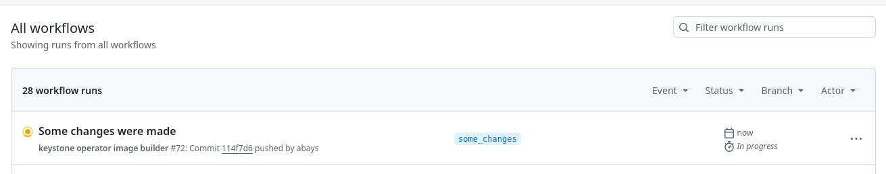
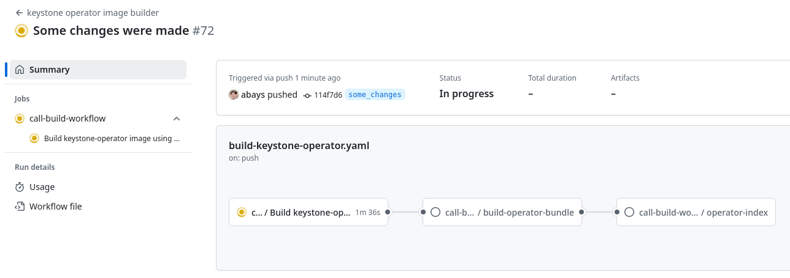

# Building and Deploying a Custom OpenStack Operator

This document describes how to build and deploy a custom OpenStack operator that incorporates changes that
you've made to one or more OpenStack service operators.  For purposes of demonstration, the following example
scenario will be described below:

1. You have created a custom Keystone operator with specific changes of your own
2. You want that custom Keystone operator deployed when you deploy OpenStack operator

The example assumes you are using [install_yamls](https://github.com/openstack-k8s-operators/install_yamls), but
the same principles apply if you were manually performing the steps that `install_yamls` automates.

## Prerequisites

First you will need to follow the [automated image build instructions](image_build.md#creating-images-using-github-actions) to set up your GitHub
forks to automatically build your operator images for you whenever you push to the forks.  For the example
below, the assumption is that this has already been done for user's OpenStack operator and Keystone operator
forks.

## Steps

### 1. Push your changes to your service operator(s)

Make your changes to your service operator and push them to your fork.  In this example case, the user has made
changes to Keystone operator and pushed them to his fork's `some_changes` branch.

```bash
$ cd keystone-operator
$ git push
remote: 
remote: Create a pull request for 'some_changes' on GitHub by visiting:
remote:      https://github.com/abays/keystone-operator/pull/new/some_changes
remote: 
To ssh://github.com/abays/keystone-operator.git
 * [new branch]      some_changes -> some_changes
```

This will trigger a custom build of your Keystone operator via the GitHub actions you configured in the
prerequisites above.  You can view the corresponding progress in the `Actions` tab of your fork:




### 2. Modify OpenStack Operator to use your custom service operator changes

Once the GitHub actions have finished building your service operator images, you can modify your
OpenStack operator's `go.mod` files so that they use your fork and branch.  This will also allow
your custom service operators images to be used with your custom OpenStack operator when you build
it in a few moments.

1. Use `go get` to acquire the version ID of your service operator's fork and branch

```bash
$ cd openstack-operator
$ go get github.com/abays/keystone-operator/api@some_changes
go: downloading github.com/abays/keystone-operator v0.0.2-0.20241024164030-114f7d6488b9
go: downloading github.com/abays/keystone-operator/api v0.0.0-20241024164030-114f7d6488b9
```

Notice the format of the URI: `github.com/<your GitHub user>/<your service operator fork>/api@<your branch with your changes>`.
Change this to suit your purposes.

Also notice the returned version ID: `vX.X.X-<timestamp>-<commit ID>`

Note: As an alternative to this step, the replace lines can be added to the `go.mod` files using the commit. Running the `make tidy` afterwards will replace it with the version ID.

2. Modify your OpenStack operator `go.mod` files (both at the root dir and the `apis` dir) to include a
`replace` that uses your custom service operator version (do this via your IDE, the output below just
shows the aftermath)

```bash
$ tail -1 go.mod
replace github.com/openstack-k8s-operators/keystone-operator/api => github.com/abays/keystone-operator/api v0.0.0-20241024164030-114f7d6488b9
$
$ tail -1 apis/go.mod
replace github.com/openstack-k8s-operators/keystone-operator/api => github.com/abays/keystone-operator/api v0.0.0-20241024164030-114f7d6488b9
```

Do not forget to run `make tidy` to guarantee that the `go.sum` files will be correctly updated.

### 3. Build your custom OpenStack Operator

Build the custom OpenStack operator (this will take a few minutes)

Do not forget to login to your Quay account with `podman login` before running the command below.

```bash
$ IMAGE_TAG_BASE=quay.io/andrewbays/openstack-operator VERSION=0.0.1 IMG=$IMAGE_TAG_BASE:v$VERSION make manifests build docker-build docker-push bundle bundle-build bundle-push catalog-build catalog-push
```

Note: If your GitHub username is NOT the same as your Quay username add `IMAGENAMESPACE=<your Quay username>`
also to the list of environment variables at the beginning of the command.

Notice the `IMAGE_TAG_BASE` and `VERSION` variables: `quay.io/<your Quay username>/openstack-operator`
and `X.X.X`, respectively.  Use your Quay username and choose an arbitrary version, such as `0.0.1`.  If
you are building a custom OpenStack operator and have previously used this combination of `IMAGE_TAG_BASE`
and `VERSION` in the same cluster, choose a new `VERSION` that you have not used beforehand.  Failure to
do so will cause your cluster to use the old cached `VERSION` from a previous build and thus you will not
deploy your changes.

### 4. Deploy your custom OpenStack Operator

1.  Using `install_yamls`, first make sure you do not have a current OpenStack operator installed

```bash
$ cd install_yamls
$ make openstack_cleanup
```

2. Deploy your custom OpenStack operator that includes your custom service operator changes

```bash
$ OPENSTACK_IMG=quay.io/andrewbays/openstack-operator-index:v0.0.1 make openstack
```

Notice the URI format of the `OPENSTACK_IMG` variable: `quay.io/<your Quay username>/openstack-operator-index:v<your custom version tag>`.
Use your Quay username and the version you specified via `VERSION` when you built your custom OpenStack operator.

Within a few minutes, your custom OpenStack operator and custom service operators(s) will be available for use.

### 5. Create OpenStack Operator CRs

Now you can create an `OpenStackControlPlane` CR, for instance, and test the changes in your custom service operator.

```bash
$ make openstack_deploy
```
